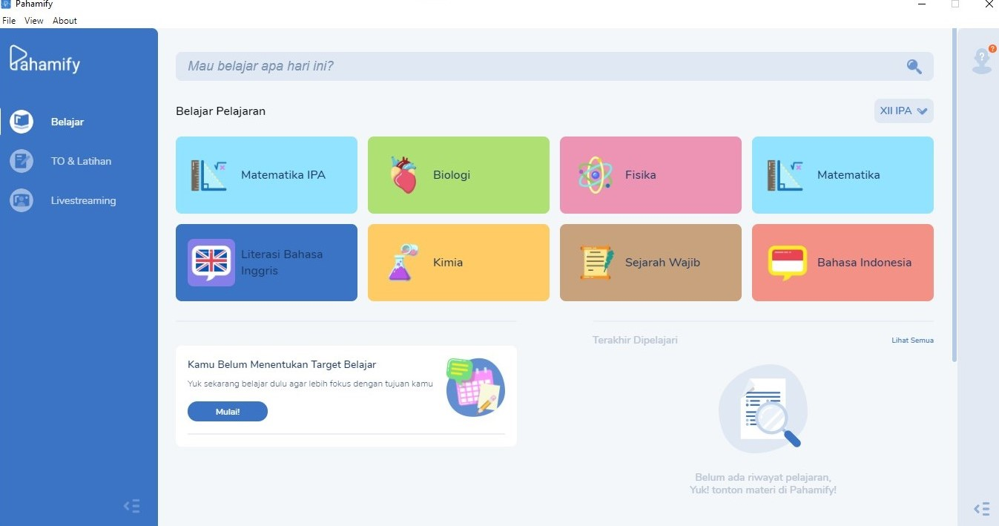
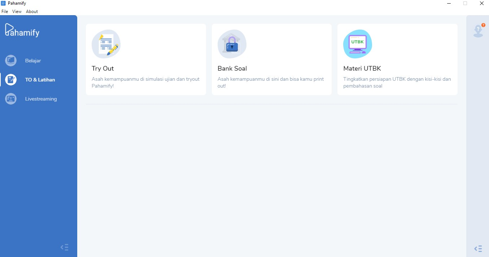

**Nama : Meyda Wikaromah**

**NIM : 2110131220015**

# **Review Aplikasi/Software sebagai Tutor, Tools, dan Tutee (Pahamify)**

Pahamify adalah sebuah aplikasi pembelajaran berbasis digital yang dirancang untuk membantu siswa, khususnya siswa sekolah menengah atas (SMA), dalam mempersiapkan diri menghadapi ujian, seperti Ujian Tulis Berbasis Komputer (UTBK) yang merupakan bagian dari Seleksi Bersama Masuk Perguruan Tinggi Negeri (SBMPTN) atau sekarang disebut SNBT di Indonesia.

Aplikasi ini menawarkan berbagai fitur, termasuk video pembelajaran yang interaktif, soal latihan, simulasi ujian, serta materi pembelajaran sesuai dengan kurikulum nasional yang disajikan dengan pendekatan yang menarik, seperti penggunaan animasi dan gamifikasi. Pahamify bertujuan untuk membuat proses belajar menjadi lebih menyenangkan dan efektif, dengan memberikan pengalaman belajar yang personal melalui rekomendasi yang disesuaikan dengan kebutuhan setiap siswa.

## **Tampilan Antarmuka dan Navigasi Pahamify**
Pahamify memiliki desain yang simple dan minimalist dengan tampilan visual yang cerah dan ikon yang menarik. Setiap fitur dan menu pada aplikasi pahamify mudah ditemukan dan diakses. Navigasi dalam aplikasi ini intuitif dengan kategori yang terorganisir dengan baik sehingga kita sebagai pengguna dapat dengan mudah berpindah antar topik. Ada juga sidebar yang memuat fitur-fitur utama dalam aplikasi ini.

    

## **Fitur-fitur Utama Pahamify**
Di aplikasi pahamify ini ada beberapa fitur utama yang dapat membantu kita dalam proses pembelajaran.

    

**Pertama**, ada fitur Belajar, nah dibagian ini terbagi lagi menjadi tiga sub bagian kecil, yaitu :

1. **Belajar Pelajaran**

    

    
    

    
    Dibagian ini kita dapat mengakses mata pelajaran seperti Matematika, Biologi, Literasi Bahasa Inggris, dan masih banyak lagi. Materi-materi pembelajaran disajikan dalam bentuk video animasi yang menarik dan menyenangkan, kemudian setelah pembelajaran akan ada kuis untuk menguji pemahaman, selanjutnya disediakan juga rangkuman dari materi yang telah selesai kita pelajari. Ada flashcard ... Diakhir pembelajaran juga diberikan Tes Akhir Materi.

2. **Tips dan Motivasi**
    
    

    
    

    Dibagian ini kita disajikan berbagai tips dan motivasi berupa video tentang bagaimana cara belajar, bagaimana cara memahami tujuan belajar, dan juga belief system (meningkatkan rasa ingin tahu). 

3. **Ekstrakurikuler**

    

    
    

    Dibagian ini disajikan beberapa video pelatihan untuk meningkatkan skill kita, contohnya seperti tentang bagaimana menggunakan Photoshop untuk pemula dan bagaimana membuat Ilustrasi Handrawn Style
    
    Selain itu, ada juga video tentang pengetahuan umum dan hal-hal unik tentang budaya, keseharian, dan lainnya.

**Kedua**, ada fitur TO & Latihan.

    

Fitur ini terbagi menjadi tiga bagian lagi yaitu Tryout, Bank Soal, dan Materi UTBK.

    

1. Fitur Tryout di Pahamify memungkinkan kita untuk mengikuti simulasi ujian UTBK dengan format dan waktu yang menyerupai ujian sesungguhnya. Soal-soal dalam tryout ini disusun berdasarkan standar soal UTBK, sehingga kita bisa mengukur sejauh mana kesiapan kita dalam menghadapi ujian.

2. Bank Soal adalah kumpulan soal-soal latihan yang tersedia di Pahamify, mencakup berbagai mata pelajaran dan topik yang diujikan dalam UTBK dan ujian sekolah lainnya.

3. Bagian Materi UTBK menyediakan rangkuman materi pelajaran yang dirancang khusus untuk persiapan UTBK. Materi ini mencakup penjelasan konsep, rumus, dan tips-tips penting yang perlu diketahui oleh siswa untuk menghadapi ujian.

**Fitur yang ketiga**, ada fitur Livestreaming. 

    

Fitur Livestreaming memungkinkan kita untuk mengikuti kelas atau sesi belajar secara langsung dengan pengajar atau tutor dari Pahamify. Selama sesi ini, pengajar menyampaikan materi pelajaran, memberikan penjelasan mendalam, dan mengajak kita untuk berpartisipasi dalam diskusi.

Jika kita tidak bisa mengikuti sesi Livestreaming secara langsung, biasanya kita masih bisa mengakses rekaman sesi tersebut di kemudian hari. Ini memungkinkan kita untuk belajar sesuai dengan waktu yang kita miliki.

Selain rekaman sesi belajar, pahamify juga tersedia rekaman sesi webinar yang dapat kita tonton untuk mendapatkan berbagai pengetahuan baru. 

## Kelebihan dan Kekurangan Pahamify

**Kelebihan Pahamify**

1. Konten Pembelajaran yang Menarik

    Pahamify menggunakan animasi, video interaktif, dan elemen gamifikasi untuk membuat pembelajaran lebih menarik dan menyenangkan. Ini membantu siswa memahami konsep-konsep sulit dengan lebih mudah.

2. Personalisasi Pembelajaran

    Aplikasi ini mampu menyesuaikan materi dan rekomendasi belajar berdasarkan kemajuan dan kesulitan yang dihadapi oleh setiap siswa, memberikan pengalaman yang lebih personal.
    
3. Simulasi Ujian yang Realistis

    Pahamify menyediakan simulasi tryout UTBK yang sangat mirip dengan kondisi ujian sesungguhnya, membantu siswa mempersiapkan diri dengan lebih baik.

4. Aksesibilitas dan Kemudahan Penggunaan
    
    Aplikasi ini memiliki antarmuka yang user-friendly dan mudah diakses oleh berbagai kalangan pengguna, dari siswa hingga orang tua.
    Fitur Komunitas dan Diskusi: Pahamify memungkinkan siswa untuk berdiskusi dan belajar bersama melalui fitur komunitas, yang membantu meningkatkan pemahaman melalui kolaborasi.

**Kekurangan Pahamify**

1. Ketergantungan pada Koneksi Internet

    Pahamify membutuhkan koneksi internet yang stabil untuk mengakses konten video dan fitur interaktif. Di daerah dengan koneksi internet yang tidak stabil, pengguna mungkin mengalami kesulitan.

2. Beberapa Fitur Premium

    Meskipun menawarkan banyak konten gratis, fitur-fitur utama seperti akses ke semua video pembelajaran dan simulasi tryout penuh terkunci di balik paywall, yang mungkin tidak terjangkau oleh semua siswa.
    
3. Penggunaan Sumber Daya

    Meskipun relatif efisien, penggunaan aplikasi dalam waktu lama bisa menguras baterai perangkat, terutama saat memutar video pembelajaran.

4. Kurangnya Pengembangan untuk Pelajaran Tertentu

    Fokus utama Pahamify adalah pada persiapan UTBK, sehingga mungkin kurang bermanfaat bagi siswa yang ingin memperdalam materi di luar kurikulum tersebut atau dari kelas yang lebih rendah.

5. Keterbatasan Interaksi Langsung dengan Tutor

    Meskipun berfungsi sebagai tutor digital, Pahamify kurang menawarkan interaksi langsung dengan pengajar atau tutor manusia, yang dapat menghambat siswa yang membutuhkan bimbingan lebih mendalam.

## Pahamify sebagai Tutor
Pahamify berfungsi sebagai tutor dengan memberikan instruksi dan penjelasan melalui video pembelajaran, soal latihan interaktif, dan penilaian otomatis. Aplikasi ini juga menyediakan rekomendasi belajar yang dipersonalisasi berdasarkan kemajuan siswa.

## Pahamify sebagai Tools
Sebagai tools, Pahamify menyediakan alat bantu seperti simulasi tryout UTBK, kalkulator, dan catatan pelajaran, yang memudahkan siswa dalam mempersiapkan ujian.

## Pahamify sebagai Tutee
Pahamify juga berperan sebagai tutee dalam hal menyesuaikan dan mempelajari preferensi belajar pengguna. Algoritma aplikasi ini terus belajar dari interaksi pengguna untuk memberikan pengalaman belajar yang lebih personal dan efektif.